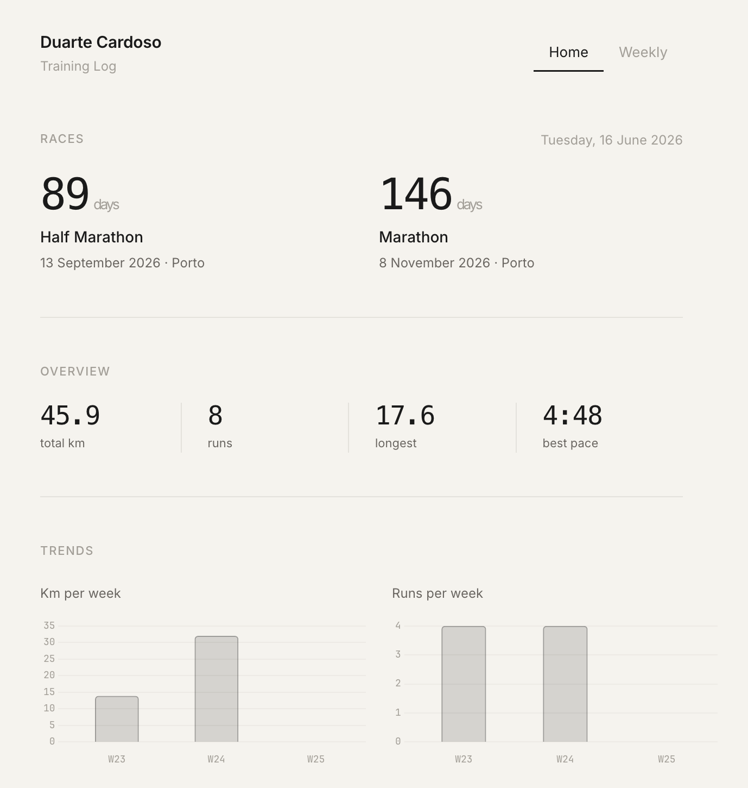

# Training Log

A minimal, automated training dashboard for marathon preparation. Built as a static GitHub Pages site that gets updated daily by [Claude](https://claude.ai) routines — no backend, no database.



## How it works

Two Claude routines run on a schedule and push data to this repo. GitHub Pages serves the dashboard.

**Weekly routine** — runs every Sunday at 6pm:
- Reviews the past week's training (completion rate, total km, highlights, areas to improve)
- Plans the next week's sessions based on training phase and progressive overload
- Creates Google Calendar events for each planned session
- Writes `week.json` with the plan and review

**Daily routine** — runs every day at 9pm:
- Checks today's Strava data for all activities (runs, gym, volleyball, etc.)
- Cross-references with what was planned in Google Calendar
- Creates a day JSON with all metrics (distance, pace, HR, elevation, shoes)
- Generates a coaching comment on what went right and what to improve
- Marks the Google Calendar event as ✅ or ❌

The dashboard reads all this data client-side and renders it — no build step.

## Data structure

```
data/
  manifest.json                  ← index of all weeks for the frontend
  weeks/
    2026-W25/
      week.json                  ← weekly plan + review
      2026-06-16-mon.json        ← one file per day
      2026-06-17-tue.json
      ...
```

Each **day file** contains:
- What was planned vs what was done
- Run metrics: distance, pace, duration, heart rate, elevation, shoes
- Gym session status and type
- AI-generated daily comment with specific observations

Each **week file** contains:
- Training plan with session descriptions
- End-of-week review with completion rate, totals, highlights, and areas to improve

## Dashboard

A single `index.html` file with two views:

- **Home** — race countdowns, aggregate stats, trend charts (km/week, runs/week, completion rate, avg pace), recent activities, and a week list
- **Weekly** — week-by-week drill-down with plan, review, and expandable day cards showing metrics and coaching comments

No framework, no dependencies beyond Chart.js (loaded via CDN). Works on mobile.

## Setup

1. Fork this repo and enable GitHub Pages
2. Connect your Strava and Google Calendar to Claude
3. Create two routines at [claude.ai](https://claude.ai):
   - **Weekly**: paste [`WEEKLY_ROUTINE.md`](routine/WEEKLY_ROUTINE.md), trigger Sunday 18:00
   - **Daily**: paste [`DAILY_ROUTINE.md`](routine/DAILY_ROUTINE.md), trigger daily 21:00
4. The routines commit and push data — the dashboard updates automatically

## Goals

| Race | Date | Location |
|------|------|----------|
| Half Marathon | 13 Sep 2026 | Porto |
| Marathon | 8 Nov 2026 | Porto |

## License

MIT
